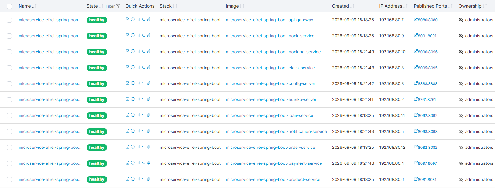

# Projet microservices — Système de gestion de bibliothèque

> Document de rendu destiné au formateur.
> Chaque étape du cahier des charges a été **prise en compte et validée**.

**Stack** : Spring Boot 3.3.2 · Spring Cloud 2023.0.3 · Java 17 · Maven · Docker Compose

**Équipe** : Rémi Petit - Matthys Herreman

---

## 1. Contexte

La bibliothèque souhaitait informatiser la gestion de son catalogue de livres et de ses
emprunts. Deux nouveaux microservices métier ont été construits — **`book-service`** et
**`loan-service`** — en réutilisant l'infrastructure déjà en place (`eureka-server`,
`config-server`, `api-gateway`).

La difficulté ajoutée par rapport au projet guidé : `loan-service` doit **lire et écrire**
chez `book-service` (décrémenter / réincrémenter le stock), ce qui introduit le problème
**TOCTOU** (*Time-Of-Check to Time-Of-Use*), traité par une **revérification côté serveur**.

---

## 2. Architecture

L'infrastructure existante (`eureka-server`, `config-server`, `api-gateway`) a été
réutilisée ; deux services métier ont été ajoutés (`book-service`, `loan-service`).

```
┌──────────────┐     ┌───────────────┐     ┌──────────────────┐
│  api-gateway │────▶│ config-server │◀────│   config-repo/   │
│    :8080     │     │      :8888    │     │   (*.yml)        │
└──────┬───────┘     └──────┬────────┘     └──────────────────┘
       │                    │ (sert la config)
       ▼                    ▼
   eureka-server ←─────────┴── (annuaire / découverte)
       :8761
       │
       ▼
┌──────────────┐  ──Feign GET────▶  ┌───────────────┐
│ order-service│                   │ product-svc   │
│     :8082    │                   │    :8081      │
└──────────────┘                   └───────────────┘
┌──────────────┐ ─Feign LECTURE+ÉCRITURE▶ ┌───────────────┐
│ loan-service │                          │ book-service  │
│     :8092    │                          │    :8091      │
└──────────────┘                          └───────────────┘
```

| Service          | Port  | Rôle                                                              |
|------------------|-------|-------------------------------------------------------------------|
| `eureka-server`  | 8761  | Service discovery / annuaire                                       |
| `config-server`  | 8888  | Configuration centralisée (profil `native`)                        |
| `api-gateway`    | 8080  | Point d'entrée unique + routage + load-balancing                   |
| `product-service`| 8081  | Catalogue de produits (JPA + H2)                                   |
| `order-service`  | 8082  | Commandes — consulte `product-service` via Feign (GET)             |
| `book-service`   | 8091  | Catalogue de livres (JPA + H2 `bookdb`)                            |
| `loan-service`   | 8092  | Emprunts (JPA + H2 `loandb`) — appelle `book-service` en lecture **et** écriture via Feign |

---

## 3. Checklist du cahier des charges

| Étape | Statut | Validation |
|-------|--------|------------|
| `book-service` : CRUD complet + validation + erreurs (404 / 400) | ✅ | `BookController` + `@Valid` + `GlobalExceptionHandler` / `ApiError` |
| `book-service` : `decrement-stock` / `increment-stock` | ✅ | Revérification serveur → **409** (défense en profondeur) |
| `loan-service` : création d'emprunt | ✅ | Feign en **lecture** puis **écriture**, `dueDate = +14 j` |
| `loan-service` : gestion des erreurs Feign | ✅ | Livre inexistant → **400**, stock épuisé / déjà rendu → **409** |
| `availableCopies` ne dépasse jamais `totalCopies` | ✅ | Contrôlé dans `increment-stock` et `update` |
| Tests unitaires (Mockito) + intégration (MockMvc) | ✅ | 36 tests, dont le cas de **concurrence TOCTOU** |
| Enregistrement Eureka + routage via la gateway | ✅ | Routes `/api/books/**`, `/api/loans/**` dans `api-gateway.yml` |
| `config-repo/book-service.yml` et `loan-service.yml` | ✅ | Ports 8091/8092, bases H2 `bookdb` / `loandb` |
| `docker-compose.yml` + `Dockerfile` (2 services) | ✅ | 7 services, build multi-stage |
| Fichier `.http` testant les scénarios via la gateway | ✅ | `api-gateway.http` (5 scénarios + bonus) |

### Bonus réalisés

| Bonus | Statut | Détail |
|-------|--------|--------|
| Recherche `?author=` / `?title=` (insensible à la casse) | ✅ | `JpaSpecificationExecutor` |
| Pagination `?page=&size=` | ✅ | retourne une `Page<BookResponse>` |
| ISBN unique → `409 Conflict` | ✅ | `DuplicateIsbnException` |
| 3 emprunts `ACTIVE` max par `memberName` | ✅ | `countByMemberNameAndStatus` → `409` |
| Docker (conteneurisation des 2 services) | ✅ | multi-stage + `docker-compose.yml` |

---

## 4. Validation technique

- **Compilation** : `mvn -pl book-service,loan-service -am clean package -DskipTests` → `BUILD SUCCESS`.
- **Tests** : `mvn -pl book-service,loan-service test` → `BUILD SUCCESS`
  - `book-service` : **19 tests** (9 unitaires + 10 intégration)
  - `loan-service` : **17 tests** (10 unitaires + 7 intégration)
- **Cas particulier couvert** : scénario « refuser l'emprunt si stock épuisé » et cas de
  **concurrence** (revérification côté `book-service`).

---

## 5. Lancer le projet

### Sans Docker
```bash
mvn -pl eureka-server spring-boot:run
mvn -pl config-server spring-boot:run
mvn -pl api-gateway   spring-boot:run
mvn -pl book-service  spring-boot:run
mvn -pl loan-service  spring-boot:run
```
Ordre : `eureka-server` → `config-server` → `api-gateway` → `book-service` → `loan-service`.

### Avec Docker
```bash
docker compose up --build
docker compose ps   # attendre que tout soit "healthy"
```

### Tester via la gateway (`http://localhost:8080`)
Les scénarios sont regroupés dans `api-gateway.http` (client REST) :
1. Création d'un livre ;
2. Création d'un emprunt réussi ;
3. Création d'un emprunt refusé (stock épuisé → `409`) ;
4. Retour d'un emprunt ;
5. Retour d'un emprunt déjà rendu → `409` ;
6. Bonus : recherche, pagination, limite de 3 emprunts par membre.

### Swagger / OpenAPI
- `book-service` : `http://localhost:8091/swagger-ui.html`
- `loan-service` : `http://localhost:8092/swagger-ui.html`

---

## 6. Endpoints

### `book-service` (`:8091`)
| Méthode | Endpoint | Rôle |
|---------|----------|------|
| `GET`    | `/api/books`                        | Liste (filtres `?author=`, `?title=`, pagination `?page=&size=`) |
| `GET`    | `/api/books/{id}`                   | Récupère un livre |
| `POST`   | `/api/books`                        | Crée un livre (`availableCopies = totalCopies`) |
| `PUT`    | `/api/books/{id}`                   | Modifie un livre |
| `DELETE` | `/api/books/{id}`                   | Supprime un livre |
| `PATCH`  | `/api/books/{id}/decrement-stock`   | (interne) décrémente le stock — `409` si déjà à 0 |
| `PATCH`  | `/api/books/{id}/increment-stock`   | (interne) réincrémente le stock — `409` si dépasse `totalCopies` |

### `loan-service` (`:8092`)
| Méthode | Endpoint | Rôle |
|---------|----------|------|
| `GET`    | `/api/loans`             | Liste les emprunts |
| `GET`    | `/api/loans/{id}`        | Récupère un emprunt |
| `POST`   | `/api/loans`             | Crée un emprunt (vérifie, décrémente, `dueDate = +14 j`) — `409` si aucun exemplaire |
| `PATCH`  | `/api/loans/{id}/return` | Rend un emprunt (réincrémente le stock) — `409` si déjà rendu |

---

## 7. Modèles

- **`Book`** : `id`, `isbn`, `title`, `author`, `totalCopies` (≥ 1), `availableCopies`
  (≥ 0, jamais > `totalCopies`).
- **`Loan`** : `id`, `memberName`, `bookId`, `bookTitle` (snapshot), `loanDate`,
  `dueDate` (= `loanDate + 14 jours`), `returnDate` (null tant que non rendu),
  `status` (`ACTIVE` / `RETURNED`).

Les erreurs sont renvoyées sous un corps uniforme `ApiError`
(`timestamp`, `status`, `error`, `message`, `details`).

---

# Module 12 — FitConnect (Réservation de cours de sport)

> **Contexte** : FitConnect est une startup qui permet de réserver des cours dans
> des salles de sport partenaires. Quatre nouveaux microservices ont été construits
> en **réutilisant** l'infrastructure existante (`eureka-server`, `config-server`,
> `api-gateway`).
>
> **Ports** : les 4 services utilisent les ports **8095-8098** (décalés car `book-service`
> (8091) et `loan-service` (8092) du TP bibliothèque occupent déjà 8091/8092).

**Stack** : Spring Boot 3.3.2 · Spring Cloud 2023.0.3 · Java 17 · OpenFeign · JPA + H2.

---

## 1. Architecture

L'infrastructure est réutilisée ; **4 services métier** on été ajoutés.

```
┌──────────────┐     ┌───────────────┐
│  api-gateway │────▶│ config-server │──▶ config-repo/*.yml (4 nouveaux fichiers)
│    :8080     │     │      :8888    │
└──────┬───────┘     └──────┬────────┘
       ▼                    ▼
   eureka-server ←─────────┴── (annuaire / découverte)
       :8761
       │
       ▼
┌──────────────────┐  Feign (get/increment/decrement)  ┌──────────────────┐
│  booking-service │────▶  class-service               │     :8095       │
│      :8096       │                                    │  base H2 "classdb"
└────────┬─────────┘                                    └──────────────────┘
         │ Feign (POST /payments, /refund)                    │
         ▼                                                    ▼
┌──────────────────┐                                ┌──────────────────┐
│  payment-service │                                │ notification-svc │
│      :8097       │                                │     :8098        │
│  base "paymentdb"│                                │ base "notifdb"   │
└──────────────────┘                                └──────────────────┘
```

| Service               | Port | Base H2      | Rôle                                                    |
|-----------------------|------|--------------|---------------------------------------------------------|
| `class-service`       | 8095 | `classdb`    | CRUD des cours + compteur de places (**verrouillage optimiste**) |
| `booking-service`     | 8096 | `bookingdb`  | Réservations (**pattern Saga** : orchestre class/payment/notification) + scheduler |
| `payment-service`     | 8097 | `paymentdb`  | Paiements simulés (accepte < 100 €, refuse ≥ 100 €) + remboursement |
| `notification-service`| 8098 | `notificationdb` | Envoi d'emails/SMS simulés + historique + retry |

---

## 2. Points pédagogiques mis en avant

| Concept | Où ? |
|---------|------|
| **Orchestration Saga** | `booking-service` : create → increment → save → notify, avec **compensation** (decrement) en cas d'échec |
| **Paiement différé** | `PENDING_PAYMENT` → confirmation → `CONFIRMED` (deadline = +1h) |
| **Politique d'annulation** | Annulation gratuite jusqu'à `classDate - 24h`, remboursement si déjà payé |
| **Verrouillage optimiste** | `class-service` : champ `@Version` sur `FitnessClass` → empêche les surréservations |
| **TOCTOU** | `booking-service` vérifie puis réserve, et `class-service` **re-vérifie** à l'écriture |
| **Snapshots** | `Booking` copie `className`, `classDate`, `instructor`, `price` (comme le module 7) |
| **Scheduler** | `booking-service` : expiration des paiements (5 min) + rappel des cours (J-24h) |
| **Circuit Breaker** | `booking-service` : resilience4j (`feign.circuitbreaker.enabled=true`) + `@FeignClient(fallbackFactory=...)` sur class/payment/notification |

---

## 3. Workflow de Réservation (Saga)

### Cas 1 — Réservation réussie
1. `booking-service` lit le cours (`GET /api/classes/{id}`) et vérifie la capacité.
2. Il réserve (`PATCH /api/classes/{id}/increment?spots=N`), re-vérifié côté `class-service`.
3. Crée la réservation **PENDING_PAYMENT** (`paymentDeadline = +1h`, `cancellationDeadline = classDate - 24h`).
4. Envoie une notification `BOOKING_CONFIRMATION`.

### Cas 2 — Plus de places (conflit)
Si `class-service` répond **409** à l'`increment` (concurrence), `booking-service`
renvoie **409** et **aucune réservation n'est créée** (cas 2 du cahier des charges).

### Cas 3 — Confirmation après paiement
`PATCH /api/bookings/{id}/confirm` → `payment-service` simule le paiement
(< 100 € accepté, ≥ 100 € refusé). Succès → `CONFIRMED` + notification.

### Cas 4 — Annulation (dans les délais)
`PATCH /api/bookings/{id}/cancel` → remboursement si payé, libération des places,
annulation + notification.

---

## 4. Endpoints

### `class-service` (`:8095`)
| Méthode | Endpoint | Rôle |
|---------|----------|------|
| `GET`    | `/api/classes`            | Liste + filtres (`?category=&level=&location=&instructor=&dateFrom=&dateTo=`) + pagination |
| `GET`    | `/api/classes/search`     | Recherche (mêmes filtres) |
| `GET`    | `/api/classes/{id}`       | Récupère un cours |
| `POST`   | `/api/classes`            | Crée un cours |
| `PUT`    | `/api/classes/{id}`       | Modifie un cours |
| `DELETE` | `/api/classes/{id}`       | Annule un cours (`status = CANCELLED`) |
| `PATCH`  | `/api/classes/{id}/increment?spots=N` | (interne) réserve des places — `409` si capacité dépassée |
| `PATCH`  | `/api/classes/{id}/decrement?spots=N` | (interne) libère des places |

### `booking-service` (`:8096`)
| Méthode | Endpoint | Rôle |
|---------|----------|------|
| `GET`    | `/api/bookings`               | Liste des réservations |
| `GET`    | `/api/bookings/{id}`          | Récupère une réservation |
| `GET`    | `/api/bookings/user/{userId}` | Réservations d'un utilisateur |
| `POST`   | `/api/bookings`               | Crée une réservation (Saga) |
| `PATCH`  | `/api/bookings/{id}/confirm`  | Confirme après paiement |
| `PATCH`  | `/api/bookings/{id}/cancel`   | Annule (rembourse + libère) |
| `PATCH`  | `/api/bookings/{id}/complete` | Marque comme terminée |
| `GET`    | `/api/bookings/expired`       | Réservations en attente expirées |

### `payment-service` (`:8097`)
| Méthode | Endpoint | Rôle |
|---------|----------|------|
| `POST`  | `/api/payments`                  | Traite un paiement (simulation) |
| `GET`   | `/api/payments/booking/{bookingId}` | Paiement d'une réservation |
| `POST`  | `/api/payments/{id}/refund`      | Rembourse |
| `GET`   | `/api/payments/user/{userId}`    | Historique d'un utilisateur |

### `notification-service` (`:8098`)
| Méthode | Endpoint | Rôle |
|---------|----------|------|
| `POST`  | `/api/notifications`                | Envoie une notification (simulation) |
| `GET`   | `/api/notifications/user/{userId}`  | Historique |
| `GET`   | `/api/notifications/pending`        | En attente (pour le scheduler) |
| `PATCH` | `/api/notifications/{id}/retry`     | Réessaie l'envoi |

---

## 5. Lancer le projet

Ordre : `eureka-server` → `config-server` → `api-gateway` → `class-service` →
`payment-service` → `notification-service` → `booking-service`.

### Sans Docker
```bash
mvn -pl eureka-server spring-boot:run
mvn -pl config-server spring-boot:run
mvn -pl api-gateway   spring-boot:run
mvn -pl class-service spring-boot:run
mvn -pl payment-service spring-boot:run
mvn -pl notification-service spring-boot:run
mvn -pl booking-service spring-boot:run
```

### Avec Docker
```bash
docker compose up --build
docker compose ps   # attendre que tout soit "healthy"
```

> ✅ **Vérification** — les 11 services sont opérationnels et **sains** (capture d'écran ci-dessous).



### Tester via la gateway (`http://localhost:8080`)
Les scénarios sont regroupés dans `fitconnect.http` (client REST) **et** dans la
**collection Postman** `fitconnect.postman_collection.json` (18 requêtes chaînées
via variables de collection : création → réservation → paiement → annulation) :
1. Création d'un cours ; 2. Réservation réussie ; 3. Réservation refusée (places pleines → `409`) ;
4. Confirmation après paiement ; 5. Annulation (remboursement) ; 6. Paiement refusé (≥ 100 €).

### Swagger / OpenAPI
- `class-service` : `http://localhost:8095/swagger-ui.html`
- `booking-service` : `http://localhost:8096/swagger-ui.html`
- `payment-service` : `http://localhost:8097/swagger-ui.html`
- `notification-service` : `http://localhost:8098/swagger-ui.html`

---

## 6. Tests

- **`class-service`** : 18 tests (10 unitaires + 8 intégration)
- **`booking-service`** : 28 tests (20 unitaires + 8 intégration)
- **`payment-service`** : 12 tests (7 unitaires + 5 intégration)
- **`notification-service`** : 10 tests (5 unitaires + 5 intégration)

```bash
mvn -pl class-service,booking-service,payment-service,notification-service -am test
```

**Total** : **68 tests**, `BUILD SUCCESS`.

Les scénarios clés couverts côté `booking-service` (orchestrateur de la Saga) :
- cycle de vie complet : réservation → paiement → annulation (places incrémentées /
  décrémentées, paiement traité puis remboursé, **3 notifications** envoyées) ;
- expiration des paiements par le scheduler (`shouldCancelExpiredBookings`) ;
- surréservation → `409` ; paiement expiré → `409` ; annulation hors délai → `409` ;
- envoi des notifications de confirmation / annulation et rappel J-24h.

---

## 7. Livrables du TP FitConnect

| Livrable | Statut | Emplacement |
|----------|--------|-------------|
| Code source (4 services) | ✅ | `class-service`, `booking-service`, `payment-service`, `notification-service` |
| Fichiers de configuration `config-repo` | ✅ | `config-repo/class-service.yml`, `booking-service.yml`, `payment-service.yml`, `notification-service.yml` |
| Routes dans `api-gateway.yml` | ✅ | 4 routes : `/api/classes/**`, `/api/bookings/**`, `/api/payments/**`, `/api/notifications/**` |
| Clients Feign + **Circuit Breaker** | ✅ | `booking-service` : 3 `@FeignClient` + `fallbackFactory` + resilience4j |
| Pattern Saga complet | ✅ | `booking-service` : réserver → payer → confirmer → annuler (avec compensation) |
| Verrouillage optimiste | ✅ | `class-service` : `@Version` sur `FitnessClass` |
| Scheduler (expiration paiements + rappels) | ✅ | `booking-service` : `BookingScheduler` (toutes les 5 min) |
| Collection Postman complète | ✅ | `fitconnect.postman_collection.json` (18 requêtes) |
| Tests unitaires + intégration | ✅ | 68 tests sur les 4 services |
| README détaillé | ✅ | Ce document (section Module 12) |
| Docker Compose | ✅ | 11 services, build multi-stage, healthchecks |

